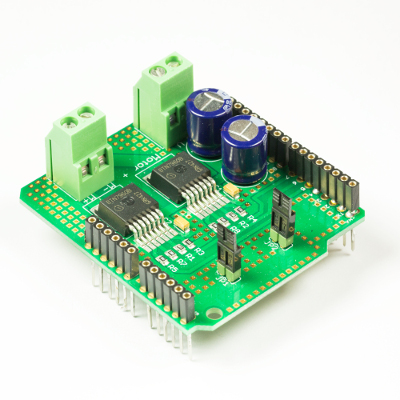

💾 Highpower Motorshield
========================

# 📸 Image

# 📂 Description

The Highpower Motorshield facilitates the control of a highpower DC (direct current) motor (18 V / 46 A) with an Arduino. The shield also permits the measurement of the motor current. For a quick and easy start, an open source Arduino library with sample programs is available.

**Features**

* Control of a normal direct current motor
* Supply voltage range: 7 to 18 Volts
* Can be used with 2S, 3S and 4S LiPo-battery
* High performance: Maximum continuous output current: 46 A
* Motor drivers are protected against short circuiting (to ground/supply), overheating, overvoltage and undervoltage
* Current measurement of the motor current
* Arduino Library with example programs is available on GitHub

# 🎥 [Video](images/highpower_motorshield_demo.mp4)
